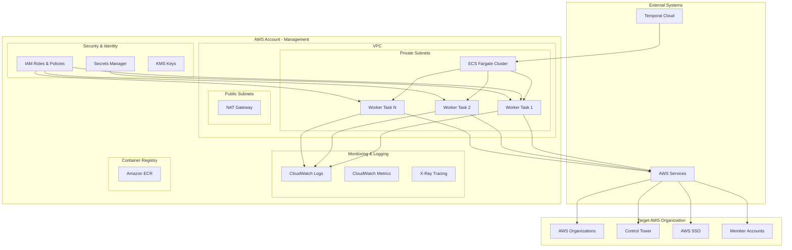
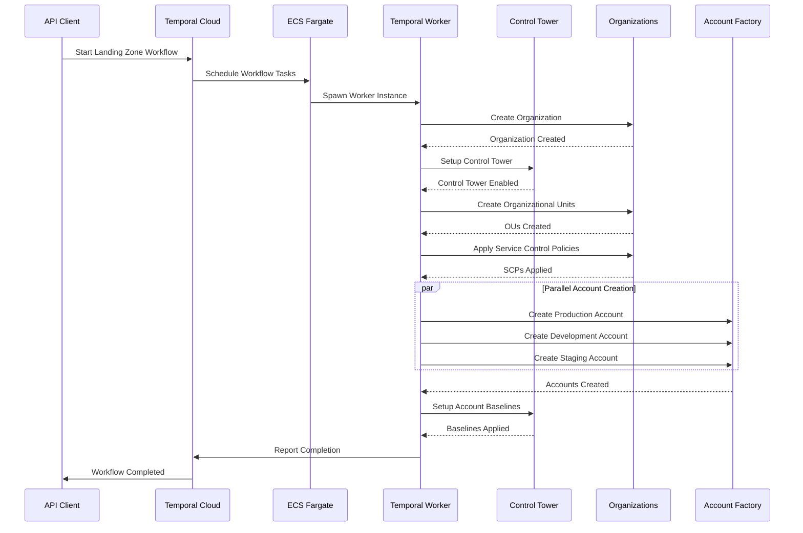
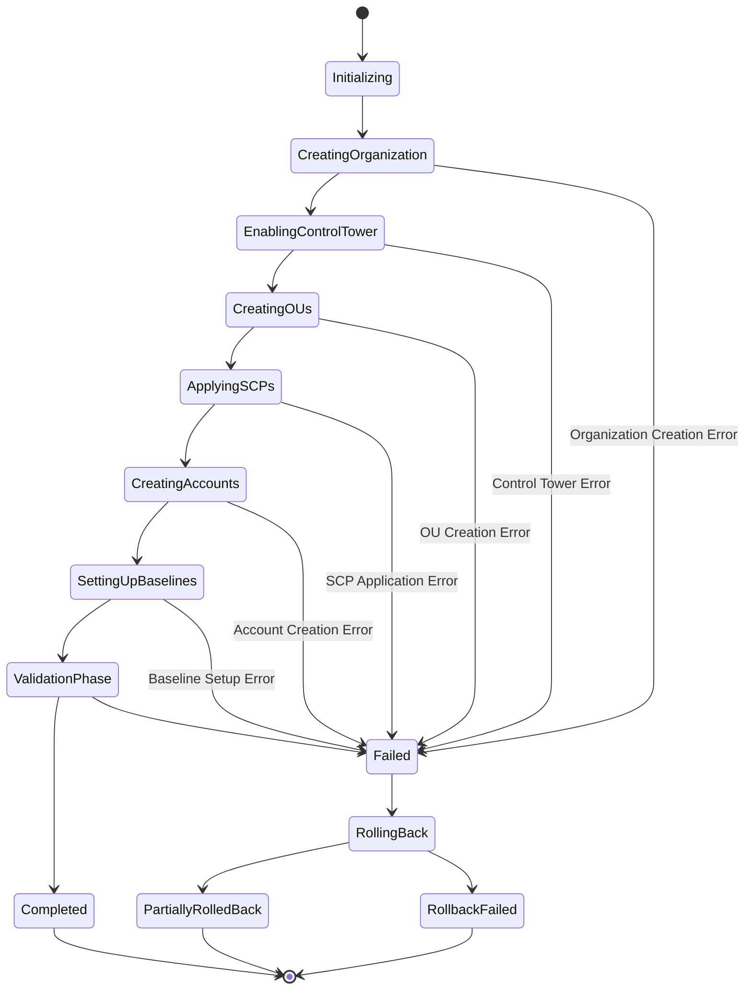

# AWS Landing Zone Provisioning with Temporal Cloud
## Detailed Design Document

### Document Information
- **Version**: 1.0
- **Date**: July 2025
- **Author**: System Architecture Team
- **Status**: Design Phase

---

## 1. Executive Summary

This document outlines the detailed design for an automated AWS Landing Zone provisioning system using Temporal Cloud workflows with ECS Fargate workers. The solution provides reliable, scalable, and observable infrastructure provisioning capabilities for enterprise AWS environments.

### 1.1 Business Objectives
- Automate AWS Landing Zone provisioning to reduce manual effort and errors
- Ensure consistent, compliant multi-account AWS environment setup
- Provide visibility and auditability for infrastructure provisioning processes
- Enable self-service capabilities for development teams
- Reduce time-to-market for new AWS workloads

### 1.2 Success Criteria
- 95% reduction in manual provisioning effort
- Zero-downtime workflow execution with automatic failure recovery
- Complete audit trail for all provisioning activities
- Sub-30 minute provisioning time for standard Landing Zone configurations

---

## 2. Architecture Overview

### 2.1 High-Level Architecture



### 2.2 Component Interaction Flow



---

## 3. Detailed Component Design

### 3.1 Temporal Cloud Integration

#### 3.1.1 Workflow Definition
- **Workflow Type**: Long-running, stateful workflow
- **Execution Timeout**: 4 hours (configurable)
- **Task Queue**: `landing-zone-provisioning`
- **Retry Policy**: Exponential backoff with maximum 3 attempts per activity

#### 3.1.2 Activity Design Patterns
```python
@activity.defn
class LandingZoneActivity:
    def __init__(self):
        self.aws_session = boto3.Session()
        self.retry_config = RetryConfig(
            region_name='us-east-1',
            retries={'max_attempts': 3, 'mode': 'adaptive'}
        )
    
    async def execute_with_monitoring(self, operation: str, params: dict):
        activity.heartbeat(f"Starting {operation}")
        try:
            result = await self._execute_operation(operation, params)
            activity.heartbeat(f"Completed {operation}")
            return result
        except Exception as e:
            activity.logger.error(f"Failed {operation}: {str(e)}")
            raise
```

#### 3.1.3 State Management
- **Workflow State**: Persisted in Temporal Cloud
- **Activity State**: Stateless with idempotent operations
- **Compensation Logic**: Built-in rollback activities for failure scenarios

### 3.2 ECS Fargate Worker Architecture

#### 3.2.1 Cluster Configuration
```yaml
Cluster Specifications:
  Name: temporal-landing-zone-workers
  Capacity Providers: [FARGATE, FARGATE_SPOT]
  Default Strategy:
    - Base: 2 tasks on FARGATE
    - Scaling: FARGATE_SPOT for additional capacity
  
Task Definition:
  CPU: 1 vCPU (1024 units)
  Memory: 2 GB (2048 MB)
  Network Mode: awsvpc
  Execution Role: temporal-worker-execution-role
  Task Role: temporal-worker-task-role
```

#### 3.2.2 Auto Scaling Configuration
```yaml
Service Auto Scaling:
  Min Capacity: 2 tasks
  Max Capacity: 20 tasks
  Target Tracking:
    - Metric: CPU Utilization
    - Target: 70%
    - Scale Out Cooldown: 300s
    - Scale In Cooldown: 600s
  
Step Scaling (Backup):
  - Scale Out: +2 tasks when CPU > 80% for 2 minutes
  - Scale In: -1 task when CPU < 40% for 5 minutes
```

#### 3.2.3 Service Discovery and Load Balancing
- **Service Discovery**: AWS Cloud Map integration
- **Health Checks**: ECS native health checks with Temporal worker heartbeat
- **Load Balancing**: Temporal Cloud handles task distribution

### 3.3 Security Architecture

#### 3.3.1 IAM Role Structure
```yaml
Roles Hierarchy:
  temporal-worker-execution-role:
    Purpose: ECS task execution
    Permissions:
      - ECR image pull
      - CloudWatch Logs write
      - Secrets Manager read
    
  temporal-worker-task-role:
    Purpose: AWS API operations
    Permissions:
      - organizations:*
      - controltower:*
      - account:*
      - sso:*
      - iam:CreateRole, AttachRolePolicy
      - s3:CreateBucket, PutBucketPolicy
      - logs:CreateLogGroup
    
  cross-account-provisioning-role:
    Purpose: Cross-account operations
    Trust Policy: Management account
    Permissions: Account-specific provisioning
```

#### 3.3.2 Network Security
```yaml
Security Groups:
  temporal-worker-sg:
    Ingress: None
    Egress:
      - HTTPS (443) to Temporal Cloud
      - HTTPS (443) to AWS APIs
      - DNS (53) for resolution
    
VPC Configuration:
  Subnets: Private subnets only
  NAT Gateway: For outbound internet access
  VPC Endpoints:
    - S3
    - ECR
    - CloudWatch Logs
    - Secrets Manager
```

#### 3.3.3 Secrets Management
```yaml
Secrets Structure:
  temporal-cloud-credentials:
    Type: SecretManager Secret
    Fields:
      - api_key: Temporal Cloud API key
      - namespace: Temporal Cloud namespace
      - host: Temporal Cloud host
    
  aws-cross-account-roles:
    Type: Parameter Store
    Structure: JSON mapping of account IDs to role ARNs
```

### 3.4 AWS Landing Zone Components

#### 3.4.1 Control Tower Configuration
```yaml
Landing Zone Manifest:
  Version: "3.3"
  Governed Regions:
    - us-east-1 (Home Region)
    - us-west-2
    - eu-west-1
  
  Organization Structure:
    Root:
      - Security OU
        - Log Archive Account
        - Audit Account
      - Sandbox OU
        - Developer Sandbox Accounts
      - Production OU
        - Production Workload Accounts
      - Non-Production OU
        - Development Accounts
        - Staging Accounts
  
  Centralized Logging:
    Account: Log Archive Account
    Retention: 7 years
    Encryption: AWS KMS
  
  Security Baseline:
    CloudTrail: Organization-wide
    Config: All governed regions
    GuardDuty: All accounts
    Security Hub: Centralized findings
```

#### 3.4.2 Service Control Policies
```yaml
SCP Strategy:
  Preventive Controls:
    - DenyRootUserAccess
    - RequireMFAForConsoleAccess
    - DenyUnencryptedS3Objects
    - RestrictRegionAccess
    - DenyDeleteOfAuditResources
  
  Detective Controls:
    - RequireCloudTrailLogging
    - RequireConfigRecording
    - RequireGuardDutyEnabled
  
  Cost Controls:
    - RestrictExpensiveInstanceTypes
    - RequireTaggingCompliance
    - DenySpotInstancesInProduction
```

#### 3.4.3 Account Factory Integration
```yaml
Account Provisioning:
  Standard Account Types:
    - Production Workload
    - Non-Production Workload
    - Sandbox
    - Security Tooling
    - Shared Services
  
  Account Baselines:
    Network:
      - VPC with standard CIDR ranges
      - Subnets across 3 AZs
      - NAT Gateways for private subnets
    
    Security:
      - IAM roles for cross-account access
      - KMS keys for encryption
      - CloudTrail integration
    
    Monitoring:
      - CloudWatch Log Groups
      - Config Rules
      - GuardDuty findings integration
```

---

## 4. Data Flow and State Management

### 4.1 Workflow State Transitions



### 4.2 Data Models

#### 4.2.1 Workflow Input Schema
```python
from dataclasses import dataclass
from typing import List, Dict, Optional
from enum import Enum

class AccountType(Enum):
    PRODUCTION = "production"
    NON_PRODUCTION = "non-production"
    SANDBOX = "sandbox"
    SECURITY = "security"
    SHARED_SERVICES = "shared-services"

@dataclass
class OrganizationalUnit:
    name: str
    parent_id: Optional[str] = None
    tags: Dict[str, str] = None

@dataclass
class ServiceControlPolicy:
    name: str
    description: str
    policy_document: Dict
    target_ous: List[str]

@dataclass
class AccountConfiguration:
    name: str
    email: str
    account_type: AccountType
    organizational_unit: str
    tags: Dict[str, str]
    baseline_config: Dict[str, any]

@dataclass
class LandingZoneConfiguration:
    organization_name: str
    home_region: str
    governed_regions: List[str]
    organizational_units: List[OrganizationalUnit]
    service_control_policies: List[ServiceControlPolicy]
    accounts: List[AccountConfiguration]
    logging_configuration: Dict[str, any]
    security_configuration: Dict[str, any]
```

#### 4.2.2 Activity Result Schema
```python
@dataclass
class ActivityResult:
    success: bool
    resource_id: str
    resource_arn: str
    metadata: Dict[str, any]
    execution_time: float
    retry_count: int

@dataclass
class WorkflowResult:
    landing_zone_id: str
    organization_id: str
    control_tower_arn: str
    created_accounts: List[Dict[str, str]]
    created_ous: List[Dict[str, str]]
    applied_scps: List[str]
    execution_summary: Dict[str, any]
    total_execution_time: float
```

### 4.3 Error Handling and Recovery

#### 4.3.1 Retry Strategies
```yaml
Retry Policies by Activity Type:
  API Rate Limited Operations:
    Initial Interval: 30 seconds
    Maximum Interval: 10 minutes
    Backoff Coefficient: 2.0
    Maximum Attempts: 5
  
  Long Running Operations:
    Initial Interval: 2 minutes
    Maximum Interval: 30 minutes
    Backoff Coefficient: 1.5
    Maximum Attempts: 3
  
  Transient Failures:
    Initial Interval: 10 seconds
    Maximum Interval: 2 minutes
    Backoff Coefficient: 2.0
    Maximum Attempts: 5
```

#### 4.3.2 Compensation Activities
```python
@activity.defn
async def rollback_control_tower_setup(landing_zone_id: str) -> bool:
    """Rollback Control Tower Landing Zone setup"""
    try:
        client = boto3.client('controltower')
        
        # Disable Control Tower
        response = client.delete_landing_zone(
            landingZoneIdentifier=landing_zone_id
        )
        
        # Wait for completion
        waiter = client.get_waiter('landing_zone_delete_complete')
        waiter.wait(operationIdentifier=response['operationIdentifier'])
        
        return True
    except Exception as e:
        activity.logger.error(f"Rollback failed: {str(e)}")
        return False
```

---

## 5. Monitoring and Observability

### 5.1 Metrics and KPIs

#### 5.1.1 Workflow Metrics
```yaml
Temporal Metrics:
  - Workflow Completion Rate
  - Average Workflow Duration
  - Activity Failure Rate
  - Retry Attempts per Activity
  - Worker Utilization
  - Task Queue Depth

Business Metrics:
  - Landing Zones Provisioned per Day
  - Time to Complete Provisioning
  - Provisioning Success Rate
  - Cost per Provisioning
  - Manual Intervention Rate
```

#### 5.1.2 Infrastructure Metrics
```yaml
ECS Metrics:
  - Task CPU/Memory Utilization
  - Task Failure Rate
  - Service Scaling Events
  - Container Start Time
  - Network Throughput

AWS API Metrics:
  - API Call Success Rate
  - API Throttling Rate
  - Control Tower Operation Duration
  - Organizations API Latency
```

### 5.2 Logging Strategy

#### 5.2.1 Log Levels and Categories
```yaml
Log Categories:
  Application Logs:
    - Workflow execution events
    - Activity start/completion
    - Error conditions and stack traces
    - Performance metrics
  
  Audit Logs:
    - AWS API calls made
    - Resource creation/modification
    - Permission changes
    - Configuration changes
  
  Security Logs:
    - Authentication events
    - Permission escalations
    - Suspicious activities
    - Compliance violations
```

#### 5.2.2 Log Aggregation and Analysis
```yaml
Log Pipeline:
  Collection: CloudWatch Logs Agent
  Aggregation: CloudWatch Logs Insights
  Analysis: Custom dashboards and queries
  Alerting: CloudWatch Alarms
  
Long-term Storage:
  Destination: S3 bucket
  Retention: 7 years
  Compression: Gzip
  Encryption: SSE-S3
```

### 5.3 Alerting and Notifications

#### 5.3.1 Alert Categories
```yaml
Critical Alerts:
  - Workflow failure rate > 5%
  - Control Tower setup failure
  - Cross-account access failure
  - Security policy violation

Warning Alerts:
  - High API throttling rate
  - Extended workflow duration
  - Worker scaling events
  - Resource quota approaching

Info Alerts:
  - Workflow completion
  - New account creation
  - Baseline application complete
```

#### 5.3.2 Notification Channels
```yaml
Notification Methods:
  - Slack integration for team notifications
  - Email for critical alerts
  - PagerDuty for after-hours incidents
  - SNS topics for programmatic integration
```

---

## 6. Security Considerations

### 6.1 Threat Model

#### 6.1.1 Identified Threats
```yaml
High Risk:
  - Unauthorized access to management account
  - Privilege escalation in member accounts
  - Data exfiltration through logging channels
  - Service disruption via resource exhaustion

Medium Risk:
  - Information disclosure through logs
  - Configuration drift in security settings
  - Dependency vulnerabilities in worker images
  - Network-based attacks on worker tasks

Low Risk:
  - Temporal workflow state tampering
  - Container image manipulation
  - DNS-based attacks
```

#### 6.1.2 Mitigation Strategies
```yaml
Access Control:
  - Least privilege IAM policies
  - Time-bound access tokens
  - Multi-factor authentication
  - Regular access reviews

Network Security:
  - Private subnets for all workers
  - VPC endpoints for AWS services
  - Security group restrictions
  - Network ACLs for additional protection

Data Protection:
  - Encryption in transit (TLS 1.3)
  - Encryption at rest (KMS)
  - Secrets management (AWS Secrets Manager)
  - Log data sanitization

Monitoring:
  - Real-time anomaly detection
  - Audit trail completeness
  - Security event correlation
  - Automated incident response
```

### 6.2 Compliance Framework

#### 6.2.1 Regulatory Requirements
```yaml
SOC 2 Type II:
  - Security controls documentation
  - Availability monitoring
  - Processing integrity checks
  - Confidentiality controls

ISO 27001:
  - Information security management
  - Risk assessment procedures
  - Security incident management
  - Business continuity planning

AWS Well-Architected:
  - Security pillar implementation
  - Reliability pillar adherence
  - Performance efficiency optimization
  - Cost optimization practices
```

### 6.3 Data Governance

#### 6.3.1 Data Classification
```yaml
Data Types:
  Highly Sensitive:
    - Account credentials
    - API keys and tokens
    - Cross-account role ARNs
    
  Sensitive:
    - Account configurations
    - Organization structure
    - User access patterns
    
  Internal:
    - Workflow execution logs
    - Performance metrics
    - Error messages
    
  Public:
    - Service documentation
    - Architecture diagrams
    - Best practices guides
```

---

## 7. Performance and Scalability

### 7.1 Performance Requirements

#### 7.1.1 Service Level Objectives (SLOs)
```yaml
Availability:
  - 99.9% uptime for workflow execution
  - 99.5% uptime for worker availability
  - < 1 hour recovery time objective (RTO)

Performance:
  - < 30 minutes for standard landing zone provisioning
  - < 2 hours for complex multi-region setup
  - < 5 seconds for workflow start latency
  - < 10% workflow failure rate

Scalability:
  - Support 100 concurrent workflow executions
  - Handle 1000 account provisioning requests per day
  - Scale workers from 2 to 50 based on demand
```

### 7.2 Capacity Planning

#### 7.2.1 Resource Estimation
```yaml
Baseline Capacity:
  ECS Tasks: 2 (minimum)
  CPU per Task: 1 vCPU
  Memory per Task: 2 GB
  Network Bandwidth: 1 Gbps burst

Peak Capacity:
  ECS Tasks: 20 (maximum)
  Total CPU: 20 vCPUs
  Total Memory: 40 GB
  Concurrent Workflows: 100

Storage Requirements:
  CloudWatch Logs: 10 GB/month
  Temporal History: 5 GB/month
  Container Images: 2 GB total
```

### 7.3 Optimization Strategies

#### 7.3.1 Workflow Optimization
```yaml
Parallelization:
  - Concurrent account creation
  - Parallel OU setup
  - Simultaneous baseline application

Caching:
  - AWS service client reuse
  - Configuration template caching
  - API response caching

Resource Pooling:
  - Connection pooling for AWS APIs
  - Worker instance reuse
  - Container image layer caching
```

---

## 8. Deployment and Operations

### 8.1 Deployment Strategy

#### 8.1.1 Infrastructure as Code
```yaml
Terraform Modules:
  - temporal-worker-infrastructure
  - iam-roles-and-policies
  - networking-and-security
  - monitoring-and-logging

Deployment Environments:
  Development:
    - Single AZ deployment
    - Minimal worker capacity
    - Development AWS accounts
  
  Staging:
    - Multi-AZ deployment
    - Production-like configuration
    - Staging AWS organization
  
  Production:
    - Full redundancy
    - Auto-scaling enabled
    - Production AWS organization
```

#### 8.1.2 CI/CD Pipeline
```yaml
Pipeline Stages:
  1. Code Quality:
     - Linting and formatting
     - Security scanning
     - Unit testing
  
  2. Build and Package:
     - Docker image building
     - Terraform validation
     - Artifact generation
  
  3. Deploy to Development:
     - Infrastructure deployment
     - Application deployment
     - Integration testing
  
  4. Deploy to Staging:
     - Blue-green deployment
     - End-to-end testing
     - Performance testing
  
  5. Deploy to Production:
     - Canary deployment
     - Health checks
     - Rollback capability
```

### 8.2 Operational Procedures

#### 8.2.1 Standard Operating Procedures
```yaml
Daily Operations:
  - Health check verification
  - Workflow execution monitoring
  - Resource utilization review
  - Error log analysis

Weekly Operations:
  - Performance trend analysis
  - Capacity planning review
  - Security audit log review
  - Cost optimization assessment

Monthly Operations:
  - Infrastructure patching
  - Access review and cleanup
  - Disaster recovery testing
  - Compliance reporting
```

#### 8.2.2 Incident Response
```yaml
Incident Severity Levels:
  Severity 1 (Critical):
    - System completely down
    - Data loss or corruption
    - Security breach
    Response Time: 15 minutes
  
  Severity 2 (High):
    - Major functionality impaired
    - Significant performance degradation
    - Service partially unavailable
    Response Time: 1 hour
  
  Severity 3 (Medium):
    - Minor functionality issues
    - Workaround available
    - Non-critical feature affected
    Response Time: 4 hours
  
  Severity 4 (Low):
    - Cosmetic issues
    - Enhancement requests
    - Documentation updates
    Response Time: Next business day
```

---

## 9. Cost Analysis and Optimization

### 9.1 Cost Breakdown

#### 9.1.1 Monthly Cost Estimation
```yaml
Temporal Cloud:
  Basic Plan: $200/month
  Actions: $0.00025 per action
  Estimated Actions: 50,000/month
  Total: $212.50/month

AWS ECS Fargate:
  Baseline Tasks (2): $45/month
  Auto-scaling Tasks: $150/month (average)
  Total: $195/month

AWS Services:
  CloudWatch Logs: $25/month
  Secrets Manager: $5/month
  NAT Gateway: $45/month
  VPC Endpoints: $25/month
  Total: $100/month

Total Monthly Cost: ~$507.50
```

#### 9.1.2 Cost Optimization Opportunities
```yaml
Short-term Optimizations:
  - Use Fargate Spot for non-critical workloads
  - Implement log retention policies
  - Optimize container image sizes
  - Use VPC endpoints selectively

Long-term Optimizations:
  - Reserved capacity for predictable workloads
  - Multi-region cost optimization
  - Automated resource cleanup
  - Usage-based scaling policies
```

### 9.2 ROI Analysis

#### 9.2.1 Cost Savings vs Manual Process
```yaml
Manual Process Costs:
  - Senior Engineer Time: 40 hours @ $100/hour = $4,000
  - Error Remediation: 8 hours @ $100/hour = $800
  - Coordination Overhead: 16 hours @ $75/hour = $1,200
  Total per Landing Zone: $6,000

Automated Process Costs:
  - Platform Operating Cost: $507.50/month
  - Monitoring and Maintenance: 4 hours @ $100/hour = $400
  Total per Landing Zone: ~$50 (assuming 20 landing zones/month)

Cost Savings per Landing Zone: $5,950
Monthly Savings (20 landing zones): $119,000
Annual ROI: 2,800%
```

---

## 10. Risk Assessment and Mitigation

### 10.1 Technical Risks

#### 10.1.1 High-Impact Risks
```yaml
Risk: Control Tower Setup Failure
  Probability: Medium
  Impact: High
  Mitigation:
    - Comprehensive pre-flight checks
    - Automated rollback procedures
    - Multiple retry attempts with exponential backoff
    - Manual intervention capability

Risk: AWS API Rate Limiting
  Probability: High
  Impact: Medium
  Mitigation:
    - Exponential backoff with jitter
    - Request rate monitoring
    - Multiple API endpoint usage
    - Circuit breaker pattern implementation

Risk: Worker Node Failure
  Probability: Medium
  Impact: Medium
  Mitigation:
    - Multi-AZ deployment
    - Auto-scaling configuration
    - Health check monitoring
    - Graceful degradation
```

### 10.2 Business Risks

#### 10.2.1 Operational Risks
```yaml
Risk: Vendor Lock-in (Temporal Cloud)
  Probability: Low
  Impact: High
  Mitigation:
    - Open-source Temporal option available
    - Standard workflow patterns
    - Portable activity implementations
    - Regular vendor relationship review

Risk: Compliance Violations
  Probability: Low
  Impact: High
  Mitigation:
    - Regular compliance audits
    - Automated policy enforcement
    - Comprehensive audit logging
    - Legal review of configurations

Risk: Skill Gap in Team
  Probability: Medium
  Impact: Medium
  Mitigation:
    - Comprehensive documentation
    - Training programs
    - Cross-training initiatives
    - External consultant relationships
```

### 10.3 Risk Monitoring

#### 10.3.1 Risk Indicators
```yaml
Technical Risk Indicators:
  - Workflow failure rate trends
  - API error rate increases
  - Worker resource exhaustion
  - Network connectivity issues

Business Risk Indicators:
  - Compliance audit findings
  - Security incident frequency
  - Vendor relationship changes
  - Team skill assessment scores
```

---

## 11. Future Enhancements

### 11.1 Planned Improvements

#### 11.1.1 Phase 2 Features
```yaml
Enhanced Automation:
  - Self-service portal for development teams
  - Advanced workflow templates
  - Configuration drift detection
  - Automated compliance reporting

Integration Expansions:
  - ServiceNow integration for change management
  - Jira integration for tracking
  - Terraform Cloud integration
  - GitHub Actions integration

Advanced Features:
  - Multi-cloud support (Azure, GCP)
  - Advanced cost optimization
  - Machine learning for anomaly detection
  - Predictive scaling
```

#### 11.1.2 Long-term Vision
```yaml
Strategic Goals:
  - Complete infrastructure lifecycle management
  - AI-powered optimization recommendations
  - Real-time compliance monitoring
  - Self-healing infrastructure capabilities

Technology Evolution:
  - Kubernetes-based worker deployment
  - Serverless workflow execution
  - Edge computing integration
  - Quantum-safe cryptography adoption
```

---

## 12. Conclusion

This detailed design provides a comprehensive blueprint for implementing an AWS Landing Zone provisioning system using Temporal Cloud and ECS Fargate. The solution addresses key requirements for reliability, scalability, security, and observability while providing significant cost savings and operational improvements.

The modular architecture allows for iterative implementation and future enhancements, ensuring the system can evolve with changing business requirements and technological advances.

### 12.1 Next Steps

1. **Proof of Concept Development** (Weeks 1-4)
2. **Infrastructure Setup** (Weeks 5-8)
3. **Core Workflow Implementation** (Weeks 9-12)
4. **Testing and Validation** (Weeks 13-16)
5. **Production Deployment** (Weeks 17-20)

### 12.2 Success Metrics

- Successful provisioning of first AWS Landing Zone within 8 weeks
- Achievement of 95% automation rate within 6 months
- Zero security incidents related to the provisioning system
- 99.9% system availability after 12 months of operation

---

**Document Control**
- **Review Schedule**: Monthly
- **Approval Required**: Architecture Review Board
- **Distribution**: Engineering Team, Security Team, Operations Team
- **Classification**: Internal Use Only